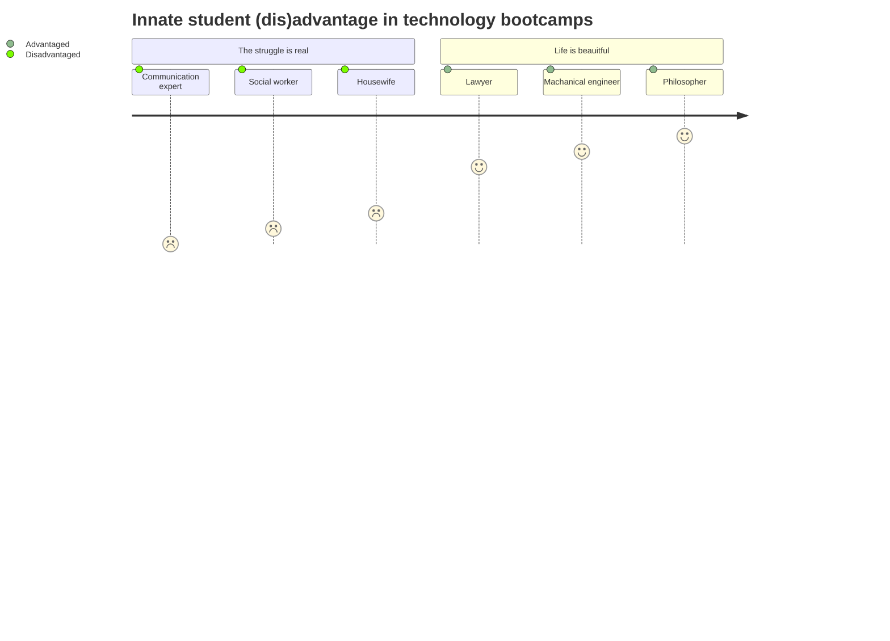

# Proposal and Description of a New Type of an Asynchronous Learning System

This is a description of an _asynchronous learning architecture and a product_ that I am proposing to lead the development of (and own shares in) at _Wild Code School_ and/or in its parent group.

## Scope

This document describes a _conceptual asynchronous learning system_ that will be greatly benefecial internally and to other bootcamp schools, when sold as a service to be used alongside the bootcamp's school offerings.

This system will also be ideal for bootcamp preparation, corporate training and skill validation (i.e. certification, job placement, etc.).

In a nutshell, a system built in this manner will be incredibly useful and a game changer in education.

## The Problem

In adult classrooms and technology bootcamps, people gather from different cultural, educational, and personal backgrounds to learn engaged topics that the academic educational system takes much longer to teach to students (on the order of 6-20 times as much). 

Often, the problem of _differentiation in the classroom_ is multipled in this demanding environment. This is due to the broad age range and the many ways in which some students may gain an _innate advantage_ over others in the area of learning a logical language.

### Logical languages

In a _logical language_ like Javascript, different symbols and character sequences, such as `[` and `??`, have a precise, real and an undisputable meaning. For example, not only that a space between the two question marks would imply something different than it would otherwise, it would also be considered "broken speech", or in logical-language terms, lead to a _syntax error_.

In the world of logical languages, the "receiver" of a logical language cannot recover from a _syntax error_ and hence must reject the speech entirely. This is due to the way in which logical languages were designed, which is, to be as accurate and as unambiguous as possible!

### Natural languages

On the other hand, the "meaning" in natural languages is constantly evolved and negotiated between two entitites who are constantly trying to guess and predict what the other entity is actually referring to in the real world.

In this realm, communication can continue to occur even when it is actually broken, namely, even when the two entities' prediction of what the other entity is referring to, is in fact, far off from what is intended 😅 (something that we all experienced at one point or another in our lives!). 

### The logical (dis)advantage

The main way in which, arguably, the biggest _differentiation gap_ is created in technology bootcamps is in students' apptitude for manufacturing, and consuming, logical languages.

For example, social workers, housewives, communication professionals and many others, might need considerably more preparation, even to begin learning something like Javascript.

Namely, this category of people might have to go through a lot of ["visual"](https://en.wikipedia.org/wiki/Visual_word_form_area) training just to be able to:

- Discern the presence of spaces around words and operators[^1]
- Discern the difference between punctuation marks that are otherwise similar, or do not have a special meaning in the writing systems of most natural languages[^2]
- The inability or the great effort required to match openers with closers (i.e. brackets and other symmetrical pairs of characters), and/or the level of difficulty involved in discerning the _hierarchy and structure_ of logical speech[^3]
- Failing to discern the hierarchy and structure of a logical expression (from the previous point) can also make it very challenging for individuals in this category to look at a relatively-simple, but a _domain-specific_ logical language, such as _mermaid_ (a logical language for creating diagrams) and draw a _correspondence_ between the mermaid description of the state diagram, and the state diagram itself, even when laid right next to each other.
- The inability or the great effort required to discern the embeddings of one logical language into another[^4]

[^1]: For example, the inability to naturally distinguish between the presence and the lack of spaces before commas in writing, and the inability to be consistent with the preservation or the elimination of such spaces, is a common observation amongst this category of people.
[^2]: For example, confusing parantheses `(` with square brackets `[` and/or using them interchangeably in a Javascript program, and being surprised to learn the completely different meaning these have in Javascript, both fall in the same category. Also, continuing to encounter difficulty using the right type of bracket, even being briefed on the difference, which indicates that a layer of visual training might be missing in this category of people.
[^3]: For example, failing to discern the end of a statement and the beginning of another in Javascript. Also, finding difficulty identifying the point in the code where stuff inside of a function should go, or the point in the code where the _condition part_ of an `if` statement should be placed.
[^4]: For example, the embedding of JSX inside of Javascript, and the consequential "switch" in grammer rules resulting from such  an embedding. This becomes even more challenging, as the JSX notation provides its own way of "switching back" to the Javascript context, right from within of the JSX context itself 🤯. It is my theory, that since natural languages offer only two levels of embedding at best, that our brains are not naturally skilled at keeping track of these many levels of embeddings without special training. Hence it makes sense why people coming from natural languages might find it very difficult to wrap their heads around these, convoluted logical statements.

> This is pretty interesting, especially when compared to seasoned lawyers, whose entire career is focused on eliminating as much ambiguity from natural speech as possible, for the purpose of protecting and defending the interest of companies and individuals under the loose and vague interpretative climate of natural languages.
>
> Indeed, it is the case that these professionals are often delighted to encounter such a logical language in a technology bootcamp, and tend to absorb its working principles like a dry sponge that has been dropped in water as soon as they get the chance to

### The differentiation problem

By now, I hope that the _innate advantage gained by some students over others in technology bootcamps_, which is the root of the differentation problem, is evident.

Note that in addition to this innate advantage, an additional advantage is also gained by having prior exposure to the content of the technology bootcamp. However, it is my belief that this type of advantahe is less severe, otherwise, everyone could have learnt this stuff just by doing online courses, and then a bootcamp would not be needed in the first place.

### Conclusion

> _In summary, if it was not for the intense differentiation challenge present in technology bootcamps, the creative synchronous learning methods seen in these bootcamps with their social, technological, and methodological aspects remain key to preparing bootcampers for the job market. Hence, it is my opinion that an **asynchronous support platform** is likely only needed to eliviate the innate (dis)advantage some students begin with in this rich, collaborative, and human-centered synchronous learning environment, which creates a lot of friction and often is the pricipal degrader of the bootcamper's user experience._

## Existing Solutions

Any platform or learning system that allows individual students to effectively work on their "missing skills" or "competences" which prevent them from catching up to the speed of the bootcamp can be seen as a solution to the innate differentiation problem.

These platforms fall into many categories of asynchronous (offline, on-demand) content:
1. Video tutorials (YouTube)
2. Project-based, paid online courses (Udemy, Coursera, etc.)
3. Interactive challenges ([CodeWars](https://www.codewars.com/kata/latest/my-languages?beta=false), HackerRank, etc.)
4. Coding games ([Oh My Git!](https://ohmygit.org/), [VIM Adventures](https://vim-adventures.com/))
5. Learning scenarios ([OREILLY](https://www.oreilly.com/work-with-us/build-interactive-learning.html), previously [Katacoda](https://www.katacoda.com/))

### The Problem with these Solutions

Almost all of these solutions are based on the idea of a _pre-prepared puzzle_, some of which are excellently designed, however, the knowledge about what the learner already knows and doesn't know is often _built into_ the design of the puzzle.

For example, an online Javascript course might be designed for the _absolute beginner_ (regardless of what that really means), and another one would attempt to help people transition from a programming language called _Swift_ to learning Javascript.

Unfortunately, the choice of whether to buy a course titled "Javascript for the absolute beginner" or another one called "Javascript for the intermediate" is often an exercise in self-belief, for most people, rather than anything else. More often than not, the course will turn out to be either "too challenging" or require a lot of perseverence to get over "the boring parts"... Never exactly the right balance for our needs!

_In either case, these asynchronous solutions have the knowledge about what the learner knows and does not know baked into them, which is the main challenge in creating the next-genertion AI explainer and teacher systems we deperately need today to upskill the population._

In the next section, I try to describe a system that overcomes this using machine learning.

## Approach

## Mock example
