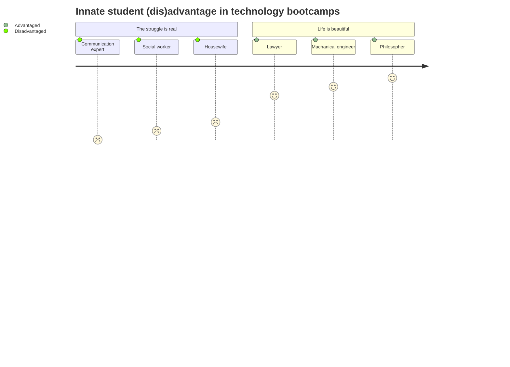

# Prep Course Recommendation

This is a recommendation of what I believe, as an instructor, to be the right direction for an asynchronous prep course for _Wild Code School_

## [1] The Problem

Before anything else, it is important to understand the problem that a _prep course_ tries to solve

In technology bootcamps, people gather from different cultural, educational, and personal backgrounds to learn engaged topics that the academic educational system takes a much longer period of time to teach (on the order of 6-20 times as much). 

Often, the problem of _differentiation in the classroom_ is multipled in this demanding environment. This is due to the broad age range of students and the many ways in which some students may gain an _innate advantage_ over others in the area of learning a logical language.

### [1.1] Logical languages

In a _logical language_ like Javascript, different symbols and character sequences, such as `[` and `??`, have a precise and an undisputable meaning. For example, not only that adding a space between the two question marks above would imply something completely different than what it would otherwise, it would also turn it into "broken speech", or in logical-language terms, lead to a _syntax error_.

In the world of logical languages, the "receiver" of the logical language cannot recover from a _syntax error_ and hence must reject the speech entirely. This is due to the way in which logical languages are designed, which is, to be as accurate and as unambiguous as possible![^6]

[^6]: Think about what would happen if the receiver of a logical language was allowed to rectify the logical message at its own discretion when it does not make sense, then ambiguity might arise, which counters the original objective of such a language. If such a language was used to control a machine, then this implies that the machine might behave unpredictably.

### [1.2] Natural languages

On the other hand, the "meaning" in natural languages is constantly evolved and negotiated between two entitites (people, usually) who are constantly trying to guess/predict what the other entity is actually referring to in the real world.

In this realm, communication can continue to occur even when it is actually broken, namely, even when the two entities' prediction of what the other is referring to is far off from what is intended 😅 (something that we all experienced at one point or another when communicating with another human!). 

### [1.3] The logical disadvantage

The main way in which, arguably, the biggest _differentiation gap_ is created in technology bootcamps is in the students' apptitude for manufacturing and consuming logical languages.

For example, social workers, housewives, communication professionals and many others, might need considerably more preparation, ***even before dreaming to begin learning something like Javascript!***

Namely, this category of people might have to go through a lot of ["visual"](https://en.wikipedia.org/wiki/Visual_word_form_area) training just to be able to:

- Discern the presence of spaces around words and operators[^1]
- Discern the difference between punctuation marks that are otherwise similar, or do not have a special meaning in the writing systems of most natural languages[^2]
- Match openers with closers (i.e. brackets and other symmetrical pairs of glyphs), and/or discern the _hierarchy and structure_ of logical speech[^3]
- Draw a _correspondence_ between a _domain-specific_ language, such as diagram description and the diagram itself, even when laid right next to each other(i.e. side by side), or find such a task to be incredibly challenging
- Discern the embeddings of one logical language into another[^4]
- Predict the overall function of a program even when the function of the individual lines is understood[^5]

[^1]: For example, the inability to naturally distinguish between the presence and the lack of spaces before commas in writing, and the inability to be consistent with the preservation or the elimination of such spaces, is a common observation amongst this category of people.
[^2]: For example, confusing parantheses `(` with square brackets `[` and/or using them interchangeably in a Javascript program, and being surprised to learn the completely different meaning these have in Javascript, both fall in the same category. Also, continuing to encounter difficulty using the right type of bracket, even being briefed on the difference, which indicates that a layer of visual training might be missing in this category of people.
[^3]: For example, failing to discern the end of a statement and the beginning of another in Javascript. Also, finding difficulty identifying the point in the code where stuff inside of a function should go, or the point in the code where the _condition part_ of an `if` statement should be placed.
[^4]: For example, the embedding of JSX inside of Javascript, and the consequential "switch" in grammer rules resulting from such  an embedding. This becomes even more challenging, as the JSX notation provides its own way of "switching back" to the Javascript context, right from within of the JSX context itself 🤯. It is my theory, that since natural languages offer only two levels of embedding at best, that our brains are not naturally skilled at keeping track of these many levels of embeddings without special training. Hence it makes sense why people coming from natural languages might find it very difficult to wrap their heads around these, convoluted logical statements.
[^5]: I am still not sure as to why this happens. My guess is that the natural learner tends to try to collectively make sense of the all sentences in the program without taking into account the sequential execution and the temporal relationship between the different statements.

### [1.4] The logical advantage 

Compared to the previous category of people, lawyers, mathematicians and philosphers might have a much easier time adapting to the realm of logical languages.

In the case of lawyers, whose entire career is focused on eliminating as much ambiguity from natural speech as possible (for the purpose of protecting and defending their clients' interest under the loose and vague interpretative climate of natural languages), logical languages might seem like the one thing they have been seeking their entire lives.

Indeed, it is the case that these professionals are often adept to comprehending the rules of logical languages and tend to absorb its working principles like a dry sponge that fell into water

### [1.5] Prior exposure to content

In addition to the innate advantage some students may have over others, an additional advantage may also be gained by having prior exposure to the content of the technology bootcamp (e.g. the keywords, syntax rules and terminology of the technologies being taught at the bootcamp). 

Indeed, _this is the area where most prep courses will try to operate,_ thinking that this is what a bootcamp participant needs to know prior to the bootcamp to alleviate their suffering and reduce the _differentiation problem_ in the classroom, I strongly disagree.

In fact, if it was not for the profound difficulties of section (1.3), a lot of those who seek learning in bootcamps would be able to upskill themselves more easily and cheaply using online courses that provide all the keywords, syntax and jargon knowledge required.

### [1.6] The differentiation problem

### [1.7] Conclusion

_In summary, unlike popular belief, it is not students' lack of hard skills that determines their user experience in technology bootcamps, rather, it is, more often than not, their disadvantage with regard to their adeptness at learning a logical language._
 
Hence, an asynchronous prep course that focuses on addressing this particular disavantage is likely to be of **incredible value** to _Wild Code School_ and its sister schools, by increasing its reach and offering a better and a smoother bootcamp experience.

## [2] Format

Platforms or learning systems that allow individual students to effectively work on their "missing skills" or "competences" on their free time prior to the beginning of the bootcamp are called "asynchronous", and are ideal for the purpose of preparing the students for the bootcamp's synchronous experience.

The following asynchronous formats are common nowadays:
1. Video tutorials (YouTube)
2. Project-based, paid online courses (Udemy, Coursera, etc.)
3. Interactive challenges ([CodeWars](https://www.codewars.com/kata/latest/my-languages?beta=false), HackerRank, etc.)
4. Coding games ([Oh My Git!](https://ohmygit.org/), [VIM Adventures](https://vim-adventures.com/))
5. Learning scenarios ([OREILLY](https://www.oreilly.com/work-with-us/build-interactive-learning.html), previously [Katacoda](https://www.katacoda.com/))

Due to the rudimentary nature of the challenges in section 1.3, it is likely that interactive challenges (e.g. interactive quizzes, Kahoots, etc.) and gamified experiences will be the most effective.

### [2.1] Ideas for Prep-Course Content

1. Interactive game: Find misplaced spaces as quickly as possible (e.g. before punctuation in writing)
1. Interactive game: Match pairs of brackets, identify mismatched pairs (e.g. `[....)`)
2. Interactive game: Identify nested code blocks
3. Interactive game: Use a custom programming language that uses single glyphs to move a character on the screen, increasing levels of difficulty to ensure the learner understands the "semantic" value associated with glyphs
4. Interactive game: Combine logical functions to solve a mystery (using AND, OR, XOR and NOT)
5. Interactive game: Visual programming using Blockey, translate to Javascript, understand the relationship between the lines/blocks and the collective function of the program as a whole
6. Interactive game: Read interpreter errors, find the line where the error happened (seems silly, but incredibly difficult for some to learn how to read intepreter messages)
7. Interactive game: Use wiggly lines under text in vscode to find syntax errors. Learn how to see those and follow their lead.
8. Interactive game: Character jumps into the right XML/HTML tag in a structural document as quickly as possible (trains the user to discern structure) 
9. Kahoots: Match a diagram language with a diagram to understand how the domain-specific language works
10. Learning scenario: Learn markdown, use markdown to write about yourself
11. Learning scenario: Learn regular expressions
12. Challenges: Use regular expressions to select parts of a text
13. Visual programming challenges
14. Interactive game: Fix settings in JSON/YAML
15. etc.

